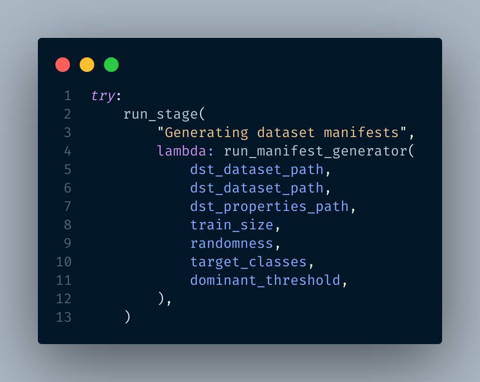

<br/>
<div align="center">

<h3 align="center">A modular dataset preparation toolkit for species-based classification pipelines.</h3>
<p align="center">
A flexible and fast dataset builder for iNaturalist-style species classification.


  


</p>
</div>

## About The Project


`dataset_builder` is a modular toolkit designed to streamline the process of preparing image classification datasets, especially for biodiversity and species-based research projects.
It provides flexible CLI tools and Python APIs to help you:
- Organize images by species into training and validation folders.
- Apply filtering rules based on dominant species.
- Export dataset manifests in plain text or Parquet formats.
- Handle restricted dataset creation, cross-referencing, and species-level analysis.

This package is designed with iNaturelist 2017 dataset in mind. However, it should still helps you if you want to build a similar iNaturelist-style datasets or building your own species classifier.

The project follows the DRY principle and is designed with modularity and pipeline automation in mind.

You can use the CLI to quickly build datasets, or integrate it directly into your own ML pipeline.
### Built With

This package is written entirely in Python to ensure that it can run on multiple platform easily. I use the following packages to enable the high-level feature of the package.

- [Pandas](https://pandas.pydata.org/)
- [PyArrow](https://arrow.apache.org/docs/python/index.html)
- [tqdm](https://github.com/tqdm/tqdm)
- [scikit-learn](https://scikit-learn.org/stable/)
- [matplotlib](https://matplotlib.org/)
- [matplotlib-venn](https://python-graph-gallery.com/venn-diagram/)
- [BeautifulSoup4](https://www.crummy.com/software/BeautifulSoup/bs4/doc/)
## Getting Started

This project helps you build custom fine-tuning datasets from the INaturelist collection with minimal effort. It supports tasks such as filtering species, copying matched images, generating manifests, and preparing training/validation splits - all with configurable YAML pipelines.
Whether you are training a deep learning model or simply exploring biodiversity data, this toolkit gets your dataset in shape.
### Prerequisites

- `Python >= 3.6`
- Git
### Installation

To install the package, clone the repository and install it using `pip`
```bash
git clone https://github.com/HoangPham6337/iNaturelist_dataset_builder 
cd iNaturelist_dataset_builder
pip install .
```
## Usage

This package is designed to be used through its high-level Python APIs. The typical workflow is defined in a central Python script such as `main.py` (see below), which loads a config file and runs multiple dataset preparation stages.

**Step 1: Create a YAML config file (`config.yaml`) with sections like:**

```yaml
global:
  included_classes: ["Aves", "Insecta"]
  verbose: false
  overwrite: false

paths:
  src_dataset: "iNaturelist_2017"
  dst_dataset: "haute_garonne"
  web_crawl_output_json: "./output/haute_garonne.json"
  output_dir: "./output"

web_crawl:
  total_pages: 104
  base_url: "https://www.inaturalist.org/check_lists/32961-Haute-Garonne-Check-List?page="
  delay_between_requests: 1

train_val_split:
  train_size: 0.8
  random_state: 42
  dominant_threshold: 0.9
```

**Step 2: Write and run your pipeline.** You can choose to either setup the config file or just run a single stage by passing in the required arguments
```python
def run_stage(stage_name: str, func):
    banner(stage_name)

    try:
        func()
        print("\n")
    except FailedOperation as e:
        print(f"FailedOperation during {stage_name}:\n{e}")
        raise
    except PipelineError as e:
        print(f"PipelineError during {stage_name}:\n{e}")
        raise
    except Exception as e:
        print(f"Unexpected error in {stage_name}: {type(e).__name__}: {e}")
        traceback.print_exc()
        raise FailedOperation(f"Unhandled exception in {stage_name}")


try:
    config = load_config("./config.yaml")
    validate_config(config)
except ConfigError as e:
    print(e)
    exit()


# Global
verbose = config["global"]["verbose"]
target_classes = config["global"]["included_classes"]
overwrite = config["global"]["overwrite"]

# Paths
src_dataset_path = config["paths"]["src_dataset"]
dst_dataset_path = config["paths"]["dst_dataset"]
src_dataset_name = os.path.basename(src_dataset_path)
dst_dataset_name = os.path.basename(dst_dataset_path)
output_path = config["paths"]["output_dir"]
matched_species_file = f"matched_species_{src_dataset_name}_{dst_dataset_name}.json"
matched_species_path = os.path.join(output_path, matched_species_file)
src_dataset_json = os.path.join(output_path, f"{src_dataset_name}_species.json")
dst_dataset_json = os.path.join(output_path, f"{dst_dataset_name}_species.json")
dst_properties_path = os.path.join(output_path, f"{dst_dataset_name}_composition.json")

# Web Crawl
base_url = config["web_crawl"]["base_url"]
total_pages = config["web_crawl"]["total_pages"]
delay = config["web_crawl"]["delay_between_requests"]
web_crawl_output_path = config["paths"]["web_crawl_output_json"]

# Train and validate split
train_size = config["train_val_split"]["train_size"]
randomness = config["train_val_split"]["random_state"]
dominant_threshold = config["train_val_split"]["dominant_threshold"]

os.makedirs(dst_dataset_path, exist_ok=True)
os.makedirs(output_path, exist_ok=True)

try:
    run_stage(
        "Crawling the web to obtain the dataset",
        lambda: run_web_crawl(
            base_url, web_crawl_output_path, delay, total_pages, overwrite, verbose
        ),
    )
    run_stage(
        "Getting datasets properties",
        lambda: run_analyze_dataset(
            web_crawl_output_path,
            output_path,
            dst_dataset_name,
            target_classes,
            verbose,
            overwrite,
        ),
    )
    run_stage(
        "Getting datasets properties",
        lambda: run_analyze_dataset(
            src_dataset_path,
            output_path,
            src_dataset_name,
            target_classes,
            verbose,
            overwrite,
        ),
    )
    run_stage(
        "Matching species between datasets",
        lambda: run_cross_reference(
            matched_species_path,
            src_dataset_json,
            web_crawl_output_path,
            src_dataset_name,
            dst_dataset_name,
            target_classes,
            verbose,
            overwrite,
        ),
    )
    run_stage(
        "Copying matching species",
        lambda: run_copy_matched_species(
            src_dataset_path,
            dst_dataset_path,
            matched_species_path,
            target_classes,
            verbose,
        ),
    )
    run_stage(
        "Getting datasets properties",
        lambda: run_analyze_dataset(
            dst_dataset_path,
            output_path,
            dst_dataset_name,
            target_classes,
            verbose,
            True,
        ),
    )
    run_stage(
        "Generating dataset manifests",
        lambda: run_manifest_generator(
            dst_dataset_path,
            dst_dataset_path,
            dst_properties_path,
            train_size,
            randomness,
            target_classes,
            dominant_threshold,
        ),
    )
    run_stage(
        "Generating visualization",
        lambda: run_visualization(
            src_dataset_path,
            dst_dataset_path,
            output_path,
            CLASS_LIST,
            target_classes,
            verbose,
            overwrite,
        ),
    )
    run_stage(
        "Generating Venn diagram",
        lambda: venn_diagram(
            src_dataset_json,
            web_crawl_output_path,
            src_dataset_name,
            dst_dataset_name,
            "Species Overlap Between Datasets",
            CLASS_LIST,
            os.path.join(output_path, f"{src_dataset_name}_vs_{dst_dataset_name}_venn.png"),
            verbose,
            overwrite
        )
    )
    run_stage(
        "Generating Venn diagram",
        lambda: venn_diagram(
            src_dataset_json,
            web_crawl_output_path,
            src_dataset_name,
            dst_dataset_name,
            "Species Overlap Between Datasets",
            target_classes,
            os.path.join(output_path, f"{src_dataset_name}_vs_{dst_dataset_name}_venn_target.png"),
            verbose,
            overwrite
        )
    )

except FailedOperation as failedOp:
    print(failedOp, "\n")
    print(traceback.format_exc())
    exit()
```
This sample script has the following stages:
- Web crawling
- JSON parsing
- Dataset analysis
- Cross-referencing
- Copying matched species
- Train/val manifest generation
- Visualization and Venn diagrams

The pipeline generates:
- A filtered dataset
- JSON files describing class distributions
- Visualizations (`.png`) for dominant species and overlaps
- Train/val manifest `.txt` files
## Roadmap

- [ ] Simplify `config.yaml` structure: group related options, add environmental variable support, introduce profiles (e.g., dev/prod).
- [ ] Add advanced options to `train_val_split`: support stratified splitting, per-class balancing, and deterministic sampling for reproducibility.
- [ ] Auto-generate `config.yaml` step-by-step from terminal prompts.
- [ ] Built-in summary report: after pipeline finishes, output a Markdown or HTML report: species count, splits, coverage, etc.
- [ ] Add optional CLI interface for each stage.
- [ ] Add support for export all manifests in Parquet format regardless of path format.
## Contributing

Contributions are welcome!

If you have suggestions for improvements or spot any issues, feel free to open an issue or submit a pull request.  
Please follow the existing project structure and naming conventions when contributing.

To get started:

1. Fork the repo
2. Clone your fork locally:  
   `git clone https://github.com/HoangPham6337/iNaturelist_dataset_builder`
3. Create a new branch:  
   `git checkout -b feature/your-feature-name`
4. Make your changes and commit
5. Push to your fork:  
   `git push origin feature/your-feature-name`
6. Open a Pull Request

For major changes, please open an issue first to discuss what you’d like to change.
## License

Distributed under the MIT License. See [MIT License](https://opensource.org/licenses/MIT) for more information.
## Contact

Pham Xuan Hoang – [LinkedIn](https://www.linkedin.com/in/xuan-hoang-pham/) – hoangphamat0407@gmail.com

